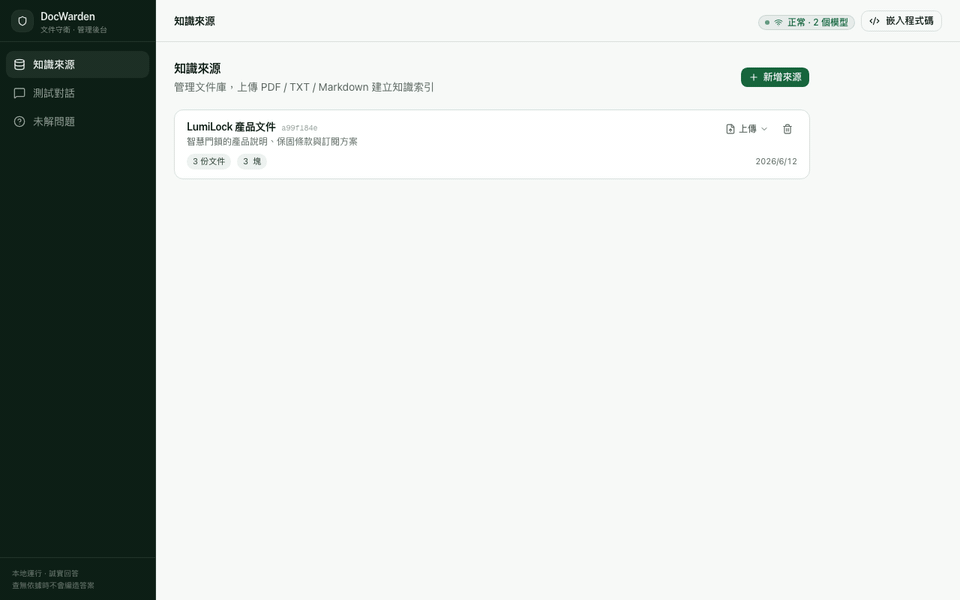
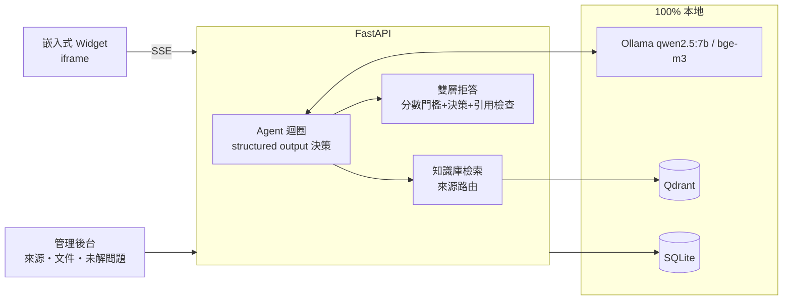

# DocWarden 🛡️

> **可嵌入任意網站、會誠實拒答的本地知識庫機器人**
> 查得到就附引用回答;查不到就明說 — 寧可拒答,不可編造。100% 本地(Ollama)。

[](https://github.com/yusyuan9224/docwarden/actions)
[](LICENSE)

## 為什麼需要 DocWarden?

社群、客服、文件站,同一個問題被問八百遍;雲端 chatbot 方案又貴、又有隱私疑慮、還會一本正經地胡說八道。DocWarden:

- 🧠 **Agentic RAG**:多步推理,自行決定查哪個知識來源、怎麼下查詢
- 🛡️ **雙層拒答防幻覺**:檢索分數門檻(硬)+ agent 拒答決策(軟)+ 無引用回答自動駁回(最後防線)
- 🔗 回答**必附來源引用**,每一步推理過程可展示
- 📋 後台「未解問題」清單 — 知道使用者問了什麼而知識庫answers不了,該補什麼文件
- 🪄 一段 `<script>` 即可嵌入任意網站
- 💸 Ollama 本地推理,零 API 費用,資料不外流



## 快速開始

**前置需求**:[Docker](https://docs.docker.com/get-docker/) 與 [Ollama](https://ollama.com)。

```bash
# 1. 模型(一次性,約 6GB)
ollama pull qwen2.5:7b && ollama pull bge-m3

# 2. 一鍵啟動
git clone https://github.com/yusyuan9224/docwarden.git && cd docwarden
docker compose up --build
```

開啟 **http://localhost:3000**:建立知識來源 → 上傳文件(.pdf/.txt/.md)→ 在「測試對話」試問。
要嵌入你的網站,點右上「嵌入程式碼」複製 iframe snippet 即可。

<details>
<summary>本機開發模式 / CLI</summary>

```bash
# 後端
cd backend && uv sync
uv run uvicorn docwarden.server:app --port 8000 --reload

# 前端(另一個終端機)
cd frontend && pnpm install && pnpm dev

# 或純 CLI 試問(臨時建庫)
cd backend && uv run docwarden ask "電池沒電怎麼辦?" --docs ../path/to/docs
```

</details>

## 架構



agent 每一步輸出結構化決策(`thought` + `action`:search / answer / refuse),搜尋結果以【資料 N】編號回饋;
最終回答必須引用編號,**無引用的回答會被自動駁回改為拒答**(防幻覺最後防線)。
拒答的問題自動記入後台「未解問題」清單,告訴站長該補什麼文件。

## 技術備註(為什麼不用 LangGraph / tool calling)

- **Agent 用自製 while-loop**(僅 httpx):線性 RAG agent 用不到 checkpointing/time-travel,LangGraph 會強制拖入 langchain-core
- **行動決策用 structured output(JSON schema)而非 Ollama 原生 tool calling**:qwen2.5:7b 的 tool calling 有未解 bug(ollama/ollama#7445 — 會捏造工具結果),而 constrained decoding 的結構化輸出在姊妹專案 [ClauseLens](https://github.com/yusyuan9224/clauselens) 已驗證穩定
- 拒答門檻設計參考 arXiv:2411.06037(Sufficient Context)

## License

[MIT](LICENSE)
